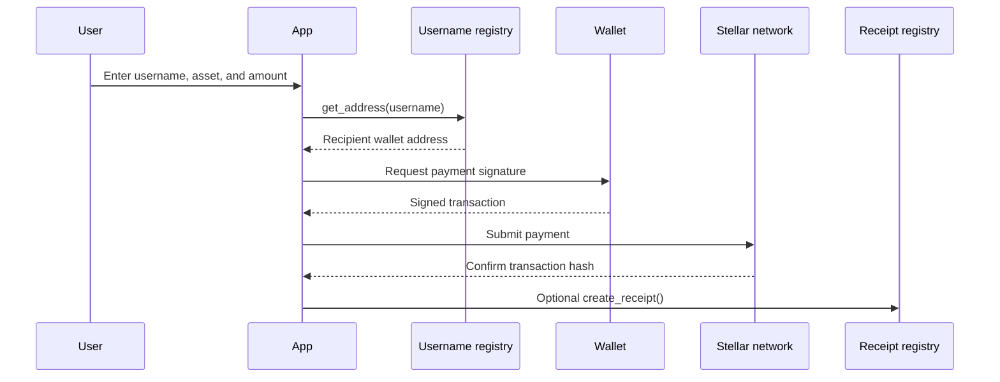

The `logic-pages` workspace powers the authenticated app at `app.coverfi.space`.

## Authentication

CoverFi uses wallet login. Protected app routes require a connected wallet session and acceptance of the current Terms and Privacy notice.

If a user opens a protected route directly, CoverFi remembers the destination in the login URL:

```txt
https://app.coverfi.space/app/protect
```

Redirects to:

```txt
https://app.coverfi.space/login?next=app/protect
```

After login, the app returns the user to `/app/protect`.

The login page **Home** action navigates in the same tab with browser back behavior. If there is no previous page, it falls back to the CoverFi landing site.

The login page includes a short onboarding checklist and links to the Terms page. Users cannot open the app until they accept the current terms version.

## Dashboard pages

| Page | Route | Purpose |
| --- | --- | --- |
| Dashboard | `/app/dashboard` | Overview of active positions, fees, claimable payouts, and expired positions. |
| Portfolio | `/app/portfolio` | Live market view powered by CoinGecko data. |
| Create Protection | `/app/protect` | Create a stablecoin protection position. |
| Positions | `/app/positions` | Track, update, revoke, and review protection positions. |
| Claims | `/app/claims` | Settle expired positions, claim reserved payouts, and withdraw protected principal. |
| Profile | `/app/profile` | Manage account profile and username. |
| Pay Username | `/app/pay-username` | Resolve a CoverFi username, execute a wallet-signed Stellar payment, and optionally anchor a receipt hash. |
| CoverFi AI | `/app/ai-chat` | Ask product, portfolio, research, and payment-draft questions. |

## Username payment flow

The **Pay Username** page is an executed Stellar payment flow. It is not only a payment draft.



The app resolves the recipient through the Soroban `username_registry`, builds a Stellar payment operation, asks the user's wallet to sign, submits the signed transaction, and polls for confirmation. After the payment succeeds, the app can anchor a receipt hash through the Soroban `receipt_registry`.

Private receipt notes and local payment history stay in wallet-unlocked encrypted browser storage. The receipt registry stores hashes and access state, not raw private payment notes.

## Protection flow

The protection form collects:

- Asset
- Protected amount
- Duration
- Current price

Duration is selected through a popup so the form stays readable on desktop and mobile.

When submitted, the app estimates:

- Protection fee
- Entry price captured by the contract from the fresh oracle quote
- Expiry time
- Potential payout

If Soroban configuration is present, the app can create the protection position on-chain through the configured protection engine contract.

After expiry, the app identifies positions that need settlement. Settlement is permissionless, while payout claims and principal withdrawals are owner-only wallet-signed actions. Private profile, payment, receipt, draft, and AI records are stored in wallet-unlocked encrypted IndexedDB rather than a backend product database.

## Sidebar and layout

The dashboard sidebar is fixed on desktop so it does not scroll with page content. On mobile, navigation adapts into a compact top layout.

The app has been tuned for mobile with responsive grids, reduced overflow, and scroll-safe controls.

## Favicon and logo

The app uses the CoverFi logo from:

```txt
logic-pages/public/logo.png
```

The same image is used for the app favicon and CoverFi AI avatar.
