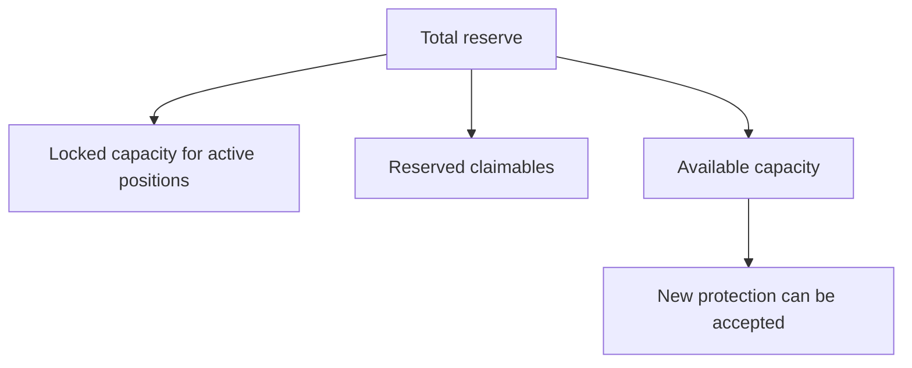

This page explains the words used across CoverFi.

## Mental model

```txt
Premiums and seeded reserve create liquidity.
Active positions lock some of that liquidity.
Settled payouts can only use position-specific reserved liquidity.
Wallet signatures approve every user action.
```

## Terms

| Term | Meaning |
| --- | --- |
| Stellar | The network CoverFi uses for accounts, payments, and assets. |
| Soroban | Stellar's smart contract platform. |
| XLM | Stellar's native asset. |
| Wallet | The user-controlled account that signs transactions. |
| Liquidity | Funds available in a vault to support future claims. |
| Reserve | The vault balance used to back eligible payouts. |
| Premium | Fee paid to open a protection position. |
| Payout | Contract-approved amount after expiry settlement. |
| Oracle | A source of price data for contracts. |
| Stale price | Oracle data that is too old to safely use. |
| Basis points | 1/100 of a percent. `100 bps = 1%`. |
| Admin | Privileged account used for controlled operations. |
| Pause | Emergency control to stop sensitive flows. |
| Audit | Independent smart contract review. |

## Protection is not insurance

CoverFi does not promise to make users whole. A payout depends on:

- Contract state.
- Entry price captured from the oracle at position creation.
- Oracle freshness.
- Reserve capacity.
- Position-specific reserve accounting.
- User signature.
- Stellar network execution.

## Why reserves matter



The product should not accept exposure that the reserve cannot support. That is why active positions lock max payout capacity.

## Why oracle policy matters

Contracts cannot read market prices by themselves. CoverFi uses an oracle adapter that stores price and timestamp data. The protection engine rejects stale prices.

For mainnet scale, the oracle policy should use multiple sources or an established Stellar-compatible oracle provider, with deviation checks and emergency pause rules.
