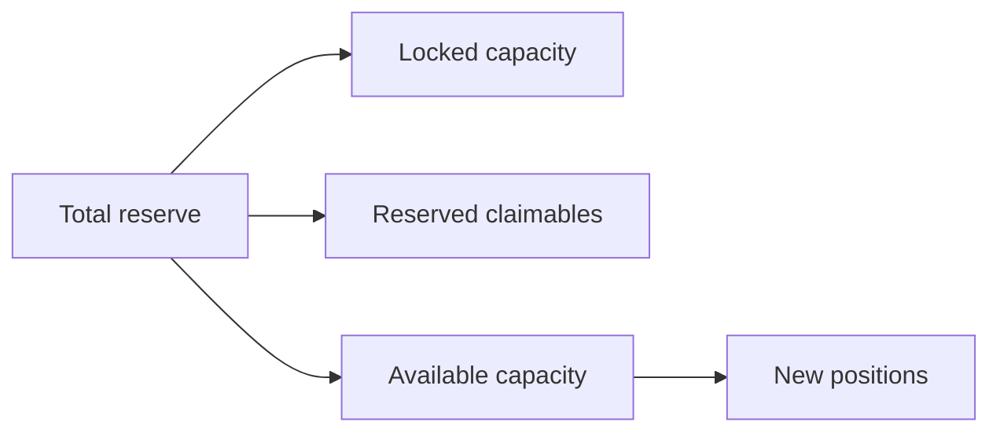
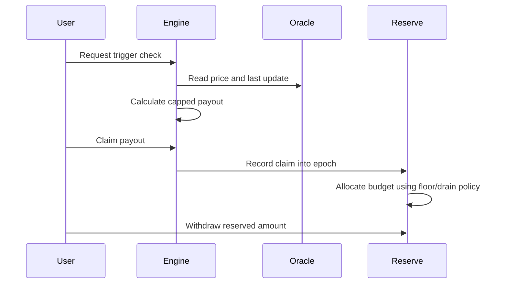

The CoverFi economics model is designed around visible fees, capped payout exposure, and reserve capacity accounting.

## Core formula

For a protected amount `A`, entry price `E`, current price `P`, premium rate `R`, and maximum payout cap `C`:

```txt
premium_fee = A * R
raw_loss = A * max(0, (E - P) / E)
max_payout = A * C
final_payout = min(raw_loss, max_payout)
```

Example:

| Input | Value |
| --- | --- |
| Protected amount | `1,000 USDC` |
| Premium rate | `1.00%` for 7 days |
| Entry price captured at creation | `1.00` |
| Current price at claim | `0.94` |
| Max payout cap | `10%` |

```txt
premium_fee = 1,000 * 0.01 = 10 USDC
raw_loss = 1,000 * ((1.00 - 0.94) / 1.00) = 60 USDC
max_payout = 1,000 * 0.10 = 100 USDC
final_payout = min(60, 100) = 60 USDC
```

## Reserve capacity and restricted payouts

Every active position locks the maximum payout amount from available reserve capacity. This prevents the app from accepting more exposure than the reserve can support.



```txt
available_capacity = total_reserve - locked_capacity - reserved_claimables
```

When a position expires without a trigger, unused locked capacity is released.

When a claim is approved, the vault does not transfer the payout immediately. It records the approved claim into the current epoch. An admin/operator then closes the epoch, and the reserve vault allocates claimable value using:

```txt
surplus = total_reserve - floor_reserve - already_reserved
epoch_budget = min(unpaid_epoch_claims, surplus * drain_bps / 10000)
user_reserved = approved_claim * epoch_budget / total_epoch_claims
```

Current testnet values:

| Policy | Value |
| --- | --- |
| Reserve floor | `2000` bps |
| Surplus drain | `5000` bps |

Users withdraw only after value has been reserved for their claim. This avoids immediate sequential payouts draining the pool.

## Example claim timeline



## Premium policy

Premiums are non-refundable after a signed position is accepted. They compensate reserve liquidity providers and increase protocol reserves depending on deployment configuration.

Current product premium schedule:

| Duration | Premium |
| --- | --- |
| 1 day | `0.30%` |
| 7 days | `1.00%` |
| 14 days | `1.50%` |
| 30 days | `2.50%` |

Premium pricing should account for:

- Asset volatility and historical depeg frequency.
- Duration.
- Entry price captured from the oracle at position creation.
- Current reserve utilization.
- Maximum payout cap.
- Oracle confidence and feed freshness.

## Risk controls

The model should not go to production without:

- Per-asset exposure limits.
- Maximum position size per wallet.
- Reserve utilization caps.
- Oracle freshness checks.
- Epoch close/withdraw monitoring.
- Emergency pause procedures.
- Published fee and payout examples.

## What this is not

CoverFi protection is not insurance, does not guarantee payout, and is not a promise that a user will be made whole. It is a smart-contract-based protection mechanism constrained by contract rules, reserve funding, oracle data, and network execution.
