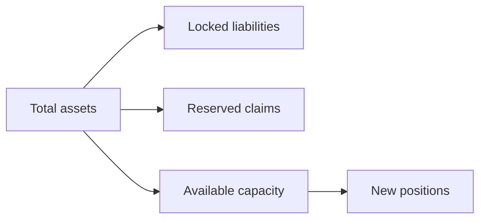
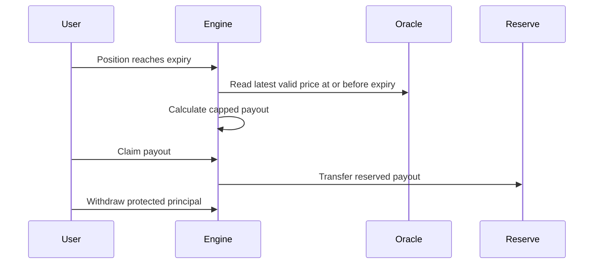

The CoverFi economics model is designed around visible fees, capped payout exposure, and reserve capacity accounting.

## Core formula

For a protected amount `A`, entry price `E`, expiry settlement price `P`, risk premium `R`, and maximum payout cap `C`:

```txt
premium_fee = quote_position(...).total_due
raw_loss = A * max(0, (E - P) / E)
max_payout = A * C
final_payout = min(raw_loss, max_payout)
```

Example:

| Input | Value |
| --- | --- |
| Protected amount | `1,000 USDC` |
| Premium rate | `1.00%` for 7 days |
| Entry price captured at creation | `1.00` |
| Expiry settlement price | `0.94` |
| Max payout cap | `10%` |

```txt
premium_fee = 1,000 * 0.01 = 10 USDC
raw_loss = 1,000 * ((1.00 - 0.94) / 1.00) = 60 USDC
max_payout = 1,000 * 0.10 = 100 USDC
final_payout = min(60, 100) = 60 USDC
```

## Reserve capacity and position-specific payouts

Every active position locks the maximum payout amount from available reserve capacity. This prevents the app from accepting more exposure than the reserve can support.



```txt
provider_nav = total_assets
  - locked_liabilities
  - reserved_claims
  - unearned_premiums
  - safety_balance
  - automation_balance
```

When a position settles with no payout, unused locked capacity is released. When a position settles with a payout, the full calculated payout is reserved for that position and the owner can claim it through the engine.

Current V2 routing:

| Policy | Value |
| --- | --- |
| Underwriting | `7800` bps |
| Protocol | `1000-1500` bps, default `1200` bps |
| Safety | `700` bps |
| Automation | Remainder plus fixed automation fee |

The protocol portion is transferred automatically to the configured treasury address during position creation. Approved partner rewards, when present, are paid from the protocol portion before the remaining protocol amount reaches treasury.

Reserve-provider withdrawals use shares, NAV, a cooldown queue, and available-liquidity checks. Locked liabilities, reserved claims, unearned premiums, safety funds, and automation funds are excluded.

## Example claim timeline



## Premium policy

Premiums are non-refundable after a signed position is accepted. They compensate reserve liquidity providers and increase protocol reserves depending on deployment configuration.

Current product premium schedule:

| Duration | Premium |
| --- | --- |
| 1 day | `0.30%` |
| 7 days | `1.00%` |
| 14 days | `1.50%` |
| 30 days | `2.50%` |

Premium pricing should account for:

- Asset volatility and historical depeg frequency.
- Duration.
- Entry price captured from the oracle at position creation.
- Current reserve utilization.
- Maximum payout cap.
- Oracle confidence and feed freshness.

## Risk controls

The model should not go to production without:

- Per-asset exposure limits.
- Maximum position size per wallet.
- Reserve utilization caps.
- Oracle freshness checks.
- Settlement, payout-claim, and principal-withdrawal monitoring.
- Emergency pause procedures.
- Published fee and payout examples.

## What this is not

CoverFi protection is not insurance, does not guarantee payout, and is not a promise that a user will be made whole. It is a smart-contract-based protection mechanism constrained by contract rules, reserve funding, oracle data, and network execution.
