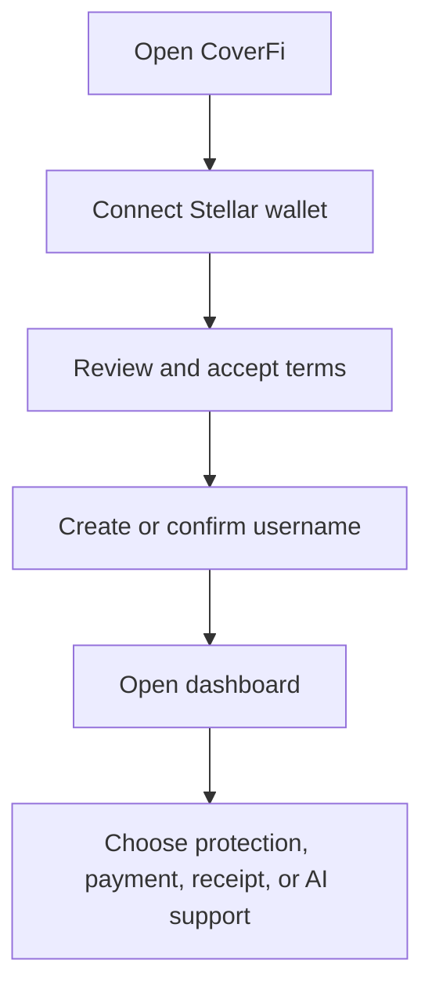
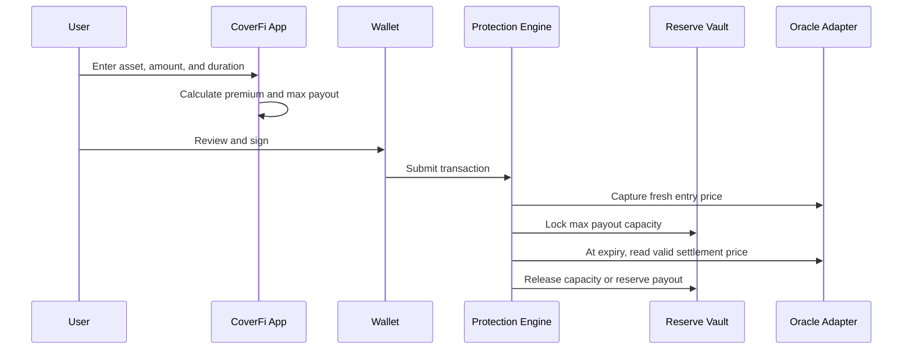
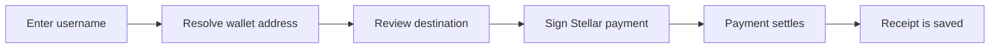

This page is for users opening CoverFi for the first time.

CoverFi protection is not insurance and does not guarantee a payout. The app shows the rules before you sign, and your wallet is always the final approval step.

## First session

## Create protection

Before signing, check:

- Asset and amount.
- Duration.
- Live price shown by the app. The contract captures the entry price from the oracle when you sign.
- Premium fee.
- Maximum payout cap.
- Wallet address.

After expiry, anyone may submit settlement. If the position is claimable, only the owner can claim the reserved payout. Principal withdrawal is a separate owner-signed action.

## Send a username payment

Username payments still settle as normal Stellar payments. After confirmation, payments are final and CoverFi cannot reverse a payment sent to the wrong address.

## Use CoverFi AI

CoverFi AI can explain screens, draft protection inputs, and help with support-style questions. It cannot sign, send funds, guarantee payouts, or replace financial/legal advice.

## What to do if something looks wrong

- Do not sign if the wallet preview does not match the app.
- Re-check the resolved username address before payment.
- Check oracle freshness and reserve state in the monitor.
- Use receipts and transaction hashes for support.
