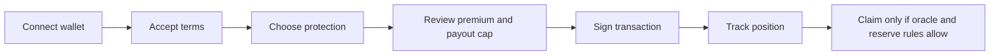

CoverFi helps Stellar users create short-term protection positions, resolve payments by username, keep receipt history, and understand reserve risk before signing.

Protection is not insurance. Payouts are not guaranteed. Every important action depends on wallet signatures, contract rules, oracle freshness, reserve state, and Stellar network execution.

## Start with your goal

<CardGroup cols={2}>
  <Card title="I am a new user" icon="circle-play" href="/getting-started">
    Learn the exact app flow from wallet connection to protection, payments, and receipts.
  </Card>
  <Card title="I am learning the terms" icon="book-open" href="/concepts">
    Understand reserves, premiums, liquidity, basis points, oracle data, claims, and epochs.
  </Card>
  <Card title="I am reviewing CoverFi" icon="clipboard-check" href="/reviewer-guide">
    See the SCF/reviewer summary, proof checklist, limitations, and milestone plan.
  </Card>
  <Card title="I am evaluating the architecture" icon="chart-line" href="/investor-architecture">
    Review the combined product, protocol, operations, and ledger transparency architecture.
  </Card>
  <Card title="CoverFi app" icon="shield-check" href="/app">
    Learn the dashboard routes, protection flow, username payments, and mobile behavior.
  </Card>
  <Card title="CoverFi AI" icon="comments" href="/ai">
    Understand chat mode, research mode, live market context, and payment drafts.
  </Card>
  <Card title="Smart Contracts Ecosystem" icon="file-contract" href="/smart-contracts/overview">
    Review the architecture, flow, deployment, and testing details of CoverFi contracts.
  </Card>
  <Card title="Security & trust" icon="lock" href="/security-trust">
    Review the threat model, oracle policy, admin policy, and audit readiness checklist.
  </Card>
  <Card title="Economics model" icon="chart-line" href="/economics">
    Understand fee, reserve capacity, payout cap, and utilization rules.
  </Card>
</CardGroup>

## How CoverFi works

CoverFi is split into a public website, authenticated app, backend API, protocol monitor, research library, docs site, and Soroban contract workspace.

## Product surfaces

| Surface | URL | Workspace |
| --- | --- | --- |
| Public site | `https://coverfi.space` | `mian-page` |
| App | `https://app.coverfi.space` | `logic-pages` |
| API | Deployment-specific | `server` |
| Protocol monitor | Local/internal | `coverfi-monitor` |
| Contracts | Stellar/Soroban | `coverfi-contracts` |

## Important behavior

Protected app routes preserve the page a user wanted to open. For example, visiting `/app/protect` directly sends the user to `/login?next=app/protect`, then returns them to `/app/protect` after wallet login.

CoverFi AI can draft payment and protection instructions, but it never executes transactions. Users must always review and sign through their wallet.

The core product is the protection and reserve workflow. AI is a support layer, not the trust anchor.
