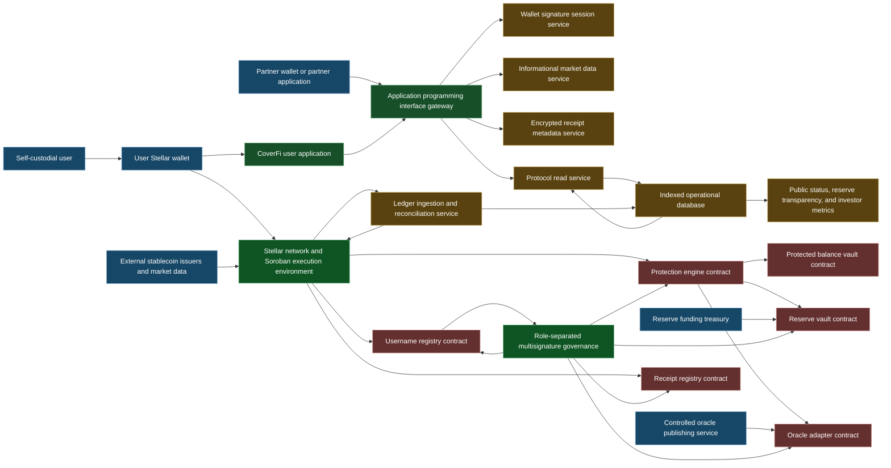
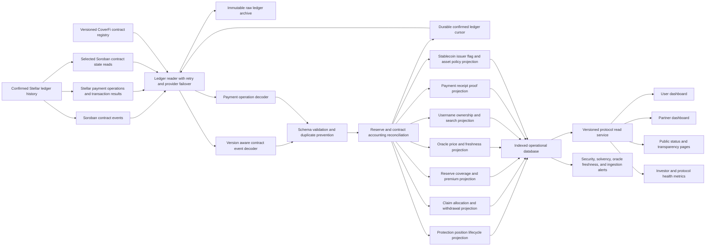

This page explains the CoverFi architecture for investors, judges, partners, and technical reviewers.

CoverFi is a self-custodial stablecoin protection and payment proof product built on Stellar and Soroban. The target architecture keeps user custody, contract rules, operational controls, and reporting data in separate layers so the product can be audited, measured, and scaled.

<Info>
  CoverFi protection is not insurance and does not guarantee payouts. Outcomes depend on wallet signatures, contract rules, oracle freshness, reserve capacity, and Stellar network execution.
</Info>

## Core idea

```txt
Protect stablecoin value. Prove payment activity. Make protocol trust visible from the ledger.
Contracts settle. Ledger ingestion explains. The application helps.
```

Users keep control of their Stellar wallets. Soroban contracts enforce protection positions, reserve capacity, price checks, username ownership, and receipt proofs. Backend services make the system usable, but they should not become the financial source of truth.

**What investors should understand first**

<CardGroup cols={2}>
  <Card title="Users keep custody" icon="wallet">
    Users sign important actions from their own Stellar wallet. CoverFi should never ask for a seed phrase or private key.
  </Card>
  <Card title="Contracts enforce rules" icon="file-contract">
    Soroban contracts define positions, premiums, reserve locks, claim accounting, usernames, and receipt proofs.
  </Card>
  <Card title="Reserves make risk visible" icon="vault">
    Reserve accounting shows total reserve, locked capacity, reserved claims, available capacity, and coverage.
  </Card>
  <Card title="Ledger data proves activity" icon="chart-line">
    Ledger ingestion turns confirmed Stellar and Soroban activity into dashboards, status pages, alerts, and investor metrics.
  </Card>
</CardGroup>

**Product thesis**

Stablecoins move quickly, but users still need downside protection, readable payment identities, verifiable receipts, public reserve and claim transparency, and clear explanations of on-chain activity. CoverFi combines those needs into one Stellar-native product.

| Product capability | What the user gets | What investors can measure |
| --- | --- | --- |
| Asset protection | A wallet-signed protection position with visible duration, premium, and maximum payout | Active protected value, premiums, locked reserve capacity, and claim activity |
| Reserve-backed claim logic | Contract-defined payout eligibility constrained by reserve capacity | Reserve coverage, allocation delay, solvency state, and utilization |
| Username payments | Human-readable payment destinations | Username growth, payment volume, and partner usage |
| Receipt proofs | Anchored evidence that a payment or protected action happened | Receipt anchors, verification activity, and dispute status |
| Ledger transparency | Publicly reconstructable protocol history | Investor dashboards, system health, and operating discipline |

**Architecture views**

The system map explains how the product, contracts, wallets, reserves, oracle, and backend connect. The ledger transparency pipeline shows how confirmed Stellar activity becomes dashboards, reserve reporting, alerts, and investor metrics.

## System architecture map

The CoverFi system should be understood as one connected architecture. The user signs from a wallet, the application prepares and explains actions, Soroban contracts enforce protocol rules, and ledger ingestion turns confirmed activity into usable data.



**Architecture layers**

| Layer | Technical role | Required boundary |
| --- | --- | --- |
| User and wallet | The user keeps keys in a Stellar wallet such as Freighter and signs protection creation, premiums, username changes, payments, receipt anchors, claims, payout withdrawals, and principal withdrawals. | The application can prepare and explain transactions, but it must not custody keys or sign user fund movement. |
| Application and backend | API gateway, wallet signature sessions, protocol read service, encrypted receipt metadata, informational market data, partner credentials, quotas, webhooks, schemas, dashboards, and status pages. | Backend services improve usability, but contracts and the ledger remain the financial source of truth. |
| Soroban contracts | The current `coverfi-contracts` workspace includes protection, reserve, protected balance, oracle adapter, quorum oracle source, username, receipt, ZK verifier, payment lock, and floor shield contracts. | Protection rules, username identity, receipt anchors, and reserve accounting are enforced by contracts, not hidden in a private server. |
| Operations and governance | Deployment identity, governance identity, oracle governance identity, oracle publisher, reserve funding treasury, fee sponsor identity, and channel accounts for high-volume operational sequence isolation. | Governance, oracle publishing, reserve funding, and fee sponsorship should be separated before meaningful mainnet exposure. |

**Core flows**

| Flow | Contract and ledger sequence |
| --- | --- |
| Protection position creation | User selects asset, amount, and duration. The app reads contract quote and configuration, shows premium, maximum payout, expiry, oracle rules, and reserve status. The user signs. Protection Engine reads a fresh entry price, Protected Balance Vault receives principal, Reserve Vault receives premium and locks maximum payout capacity, and ingestion indexes the confirmed position. |
| Claim and withdrawal | Before expiry, Protection Engine reads a fresh oracle price. If price is below entry, it calculates eligible loss. The user signs the claim request, Reserve Vault records allocation accounting, the user withdraws allocated payout and eligible principal, and ingestion updates position, claim, reserve, and investor metrics. |
| Username payment and receipt | Sender enters a username, the app resolves it to a Stellar wallet, the sender reviews address, asset, amount, and network, then signs the payment. The app creates encrypted receipt metadata and a content hash, the sender anchors the proof in Receipt Registry, and ingestion links payment result, receipt proof, and user history. |
| Oracle and reserve operations | Approved market sources feed the controlled oracle publisher, which submits fresh prices to Oracle Adapter. Reserve funding treasury deposits assets into Reserve Vault. Governance controls payout caps, oracle freshness, pause state, and reserve policy. Ingestion monitors prices, reserves, capacity, claims, and governance actions. |

## Ledger transparency pipeline

A blockchain ledger is the official record of confirmed transactions. Ledger ingestion is CoverFi reading that record, decoding protocol activity, checking it, and turning it into useful product and investor data.

This matters because users and investors should not have to inspect raw blockchain events manually. CoverFi should convert ledger truth into clear state:

- Which positions are active.
- Which claims are triggered.
- Which payouts are allocated.
- Which principal withdrawals are complete.
- How much reserve is available.
- Whether the oracle is fresh.
- Which usernames are registered.
- Which receipts are anchored.
- Whether issuer asset flags changed.



**Ledger processing model**

The ingestion pipeline should be durable, replayable, auditable, and strict about cursor movement.

| Stage | What happens |
| --- | --- |
| Confirmed ledger read | Read only confirmed Stellar ledger history |
| Raw archive | Store raw records before transformation |
| Event decoding | Decode Soroban events using the contract version active at that ledger |
| Payment decoding | Decode Stellar payment operations and transaction results |
| Validation | Check network, schema, contract identity, duplicates, and event order |
| Reconciliation | Compare indexed state with contract getters and token balances |
| Projection | Build fast read models for the application, partners, status pages, and investors |
| Alerting | Detect solvency, oracle freshness, ingestion lag, and accounting issues |

Rules: advance the durable cursor only after raw records and projections commit; make handlers idempotent by network, ledger sequence, transaction hash, operation index, contract identifier, and event index; keep raw events for rebuilds; stop advancing when accounting invariants fail; expose ingestion lag and last reconciled ledger as public health signals.

**Required read models**

| Read model | Key fields |
| --- | --- |
| Position | Owner, asset, amount, entry price, premium, start time, expiry, status, maximum payout, principal withdrawal status |
| Claim | Position, approved amount, epoch, allocated amount, withdrawn amount, remaining amount |
| Reserve asset | Total reserve, premiums, locked capacity, reserved claims, available capacity, coverage ratio |
| Oracle asset | Price, update time, age, allowed age, publisher, deviation state |
| Username | Normalized username, current wallet, registration ledger, update ledger |
| Receipt | Payment hash, sender, receiver, content hash, encrypted location, status, dispute state |
| Asset policy | Asset identifier, issuer flags, exposure cap, active exposure, operational state |

**Asset, issuer, and compliance controls**

CoverFi should not rely on asset symbols alone. Each supported asset needs precise identity, risk policy, issuer monitoring, and risk-based compliance.

| Control area | Required configuration |
| --- | --- |
| Native Stellar asset | Network and native asset identifier, oracle support, exposure cap, payout asset, and reserve coverage |
| Issued stablecoin | Asset code, issuer public key, network, trustline support, issuer policy review, redemption assessment, and asset flag monitoring |
| Soroban token representation | Token contract address, network, contract verification, decimals, issuer mapping, and transfer behavior |
| Future tokenized asset | Verified contract, legal classification, governance approval, liquidity review, oracle review, and conservative cap |
| Issuer flags | Monitor authorization required, authorization revocable, clawback enabled, and immutable authorization. Adverse changes should alert and may pause new exposure while preserving withdrawals and valid claim processing. |

| Activity | Compliance posture |
| --- | --- |
| Public website, docs, prices, status | No identity verification |
| Testnet demo activity | Wallet-only access is usually enough |
| Low-limit self-custodial mainnet activity | Wallet authentication, sanctions controls, jurisdiction policy, and terms acceptance |
| Higher-value protection or payouts | Risk-based identity verification |
| Reserve providers, institutions, partners, treasury users | Full identity or business verification |
| Fiat ramps, custody, asset exchange, or managed wallets | Full regulated compliance review before launch |

KYC data should not be stored on-chain. If eligibility checks become necessary, the compliance service should store private review data off-chain and expose only the minimum eligibility result needed by the application or contracts.

**Investor metrics**

| Metric | Why it matters |
| --- | --- |
| Active protected value | Shows current demand for protection |
| Total protection positions | Shows product usage |
| Premiums collected | Shows revenue potential and reserve strengthening |
| Total reserve | Shows financial backing |
| Locked payout capacity | Shows active risk accepted by the protocol |
| Reserve coverage ratio | Shows solvency health |
| Claim allocation delay | Shows whether claims remain orderly under stress |
| Oracle freshness | Shows whether price inputs are safe enough for product use |
| Username registrations | Shows payment identity network growth |
| Receipt anchors | Shows payment proof usage |
| Partner volume | Shows integration and platform potential |
| Ingestion lag | Shows data reliability and operational maturity |

## Implementation status and roadmap

**Why this architecture is fundable**

CoverFi is fundable because it does not ask users or investors to believe in an invisible backend promise. User keys stay self-custodied; contracts enforce protection rules; reserve capacity is locked before exposure is accepted; claims follow contract-defined accounting; receipts are anchored with cryptographic proof; ledger ingestion makes activity measurable; oracle and governance authority can be separated; and compliance can be introduced by risk level without redesigning the protocol. That supports a staged path from testnet demonstration to audited, capped mainnet deployment.

**Current implementation reality**

The canonical `coverfi-contracts` workspace is the source of truth for the current Soroban architecture: Protection Engine, Reserve Vault, Protected Balance Vault, Oracle Adapter, Quorum Oracle Source, Username Registry, Receipt Registry, ZK Verifier, Payment Lock Engine, and Floor Shield Engine. The initial mainnet scope should stay limited to audited, launch-critical contracts while optional product surfaces mature through testnet evidence.

Important gaps to close:

1. Generate and publish typed clients from the canonical contract specifications.
2. Keep protection creation, claim status, username payments, and receipt anchoring aligned to deployed contract ABIs after every redeploy.
3. Expand durable ledger ingestion and reconciliation for payments, usernames, receipts, positions, claims, reserve state, and oracle freshness.
4. Complete production partner controls for webhook validation, idempotency, per-key rate limits, and signed delivery verification.
5. Separate governance, oracle publishing, reserve funding, and operational signing roles before meaningful mainnet value.
6. Complete third-party review, legal review, incident response, and mainnet smoke-test runbooks.

**Recommended roadmap**

| Phase | Work |
| --- | --- |
| Canonical testnet coherence | Keep typed clients, app flows, backend routes, and deployed contract IDs aligned; verify username payments, receipt anchoring, protection creation, fee display, claim flow, principal withdrawal, reserve state, oracle freshness, and monitor health. |
| Operational hardening | Add multisignature governance, separate oracle publisher and governance roles, add asset allowlist and issuer flag monitoring, reconcile reserves and principal custody, add rate limits, audit logs, privacy controls, and independent contract and service review. |
| Capped mainnet pilot | Deploy reviewed mainnet contracts, seed reserve capacity, enable conservative assets, start with low per-user and per-asset exposure caps, publish reserve, claim, oracle, and ingestion metrics, and increase caps only after safety and usage thresholds are met. |
| Partner scale | Release partner interface and SDK, add webhooks and dashboards, use channel account dispatch for approved operational submissions, and add institutional reporting and reserve-provider tooling after legal review. |

**Final message**

```txt
CoverFi protects stablecoin value, simplifies payments, proves activity with receipts, and makes the whole protocol measurable from the Stellar ledger.
```

The combined architecture tells one story: users stay in control, contracts enforce the rules, reserves make protection credible, and ledger intelligence makes the protocol transparent enough for users, partners, judges, and investors to trust.
