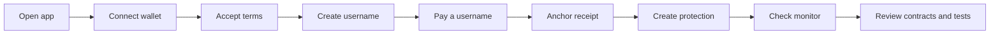

This guide gives reviewers the shortest path to understanding what CoverFi is, what is built, how to verify it, and what remains before mainnet.

## What CoverFi is

CoverFi is a Stellar-native protection and payments product. Users can register readable usernames, execute wallet-signed payments to usernames, anchor receipt hashes, create short-term protection positions, pay transparent premiums, and track claims.

The core value is the wallet-signed username payment flow, wallet-signed protection workflow, Soroban vault accounting, oracle freshness checks, reserve capacity locking, and user-readable receipt experience. AI is a support layer, not the protocol moat.

## What to verify



For the full technical map, start with [Technical architecture](/technical-architecture).

## Current proof

- `coverfi-contracts` contains the canonical contract workspace.
- `logic-pages` contains the authenticated app.
- `mian-page` contains the public website.
- `server` contains backend APIs.
- `coverfi-monitor` contains read-only protocol monitoring.
- `docs` contains official docs.
- `packages/coverfi-sdk` contains the modern partner SDK and widget.
- `partner-portal` contains the partner dashboard.

Contract verification:

```powershell
cd D:\Stellar\coverfi-contracts
cargo test
```

Latest local result:

```txt
46 Soroban unit tests passed, doctests passed.
26 backend tests passed.
Main app, partner portal, monitor, research app, landing app, and SDK checks passed.
```

Recommended verification commands:

```powershell
npm --prefix server run check
npm --prefix server test
npm --prefix packages/coverfi-sdk run check
npm --prefix partner-sdk run check
npm --prefix logic-pages run build
npm --prefix partner-portal run build
npm --prefix coverfi-monitor run build
npm --prefix coverfi-research run build
npm --prefix mian-page run build
cd D:\Stellar\coverfi-contracts
cargo test
```

## Key limitations

- Protection is not insurance.
- Payouts are not guaranteed.
- Testnet oracle publishing is controlled and should be treated as beta.
- Production needs multisig/admin controller.
- Production needs a documented multi-source oracle policy.
- Production needs third-party audit before meaningful mainnet value.
- Deployed testnet IDs must be re-verified or redeployed after contract source changes.

## Strong Tranche 1 definition

Tranche 1 should be MVP hardening and public testnet reviewer release:

- Working testnet app.
- Executed username payment and receipt anchor demo.
- Contract tests passing.
- Reviewer wallet instructions.
- Visible terms and privacy language.
- Monitor for reserve and oracle state.
- Clear docs for users and judges.

## Best one-minute explanation

> CoverFi lets Stellar users pay readable usernames, anchor private receipt hashes, and create short-term protection positions with a visible premium and capped payout. Soroban contracts resolve usernames, store receipt proofs, hold protected principal, collect premiums, lock maximum payout capacity, settle positions at expiry using oracle data, and reserve eligible payouts per position. It is not insurance, and AI only helps users draft and understand actions before wallet signing.
