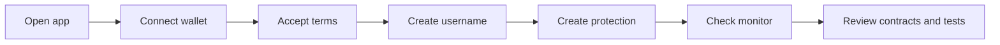

This guide gives reviewers the shortest path to understanding what CoverFi is, what is built, and what remains before mainnet.

## What CoverFi is

CoverFi is a Stellar-native protection and payments product. Users can create short-term protection positions, pay a transparent premium, send payments by username, and keep receipts.

The core value is the wallet-signed protection workflow, Soroban vault accounting, oracle freshness checks, reserve capacity locking, and user-readable payment experience. AI is a support layer, not the protocol moat.

## What to verify



## Current proof

- `coverfi-contracts` contains the canonical contract workspace.
- `logic-pages` contains the authenticated app.
- `mian-page` contains the public website.
- `server` contains backend APIs.
- `coverfi-monitor` contains read-only protocol monitoring.
- `docs` contains official docs.

Contract verification:

```powershell
cd D:\Stellar\coverfi-contracts
cargo test --target-dir ..\coverfi-contracts-target-check-2
```

Latest local result:

```txt
39 unit tests passed, doctests passed.
```

## Key limitations

- Protection is not insurance.
- Payouts are not guaranteed.
- Testnet oracle adapter is admin-updated.
- Production needs multisig/admin controller.
- Production needs third-party audit before meaningful mainnet value.
- Deployed testnet IDs must be re-verified or redeployed after contract source changes.

## Strong Tranche 1 definition

Tranche 1 should be MVP hardening and public testnet reviewer release:

- Working testnet app.
- Contract tests passing.
- Reviewer wallet instructions.
- Visible terms and privacy language.
- Monitor for reserve and oracle state.
- Clear docs for users and judges.

## Best one-minute explanation

> CoverFi lets Stellar users create short-term protection positions with a visible premium and capped payout. Soroban contracts hold principal, collect premiums, lock reserve capacity, check oracle freshness, and account for claims through restricted payout epochs. Username payments and receipts improve the user experience around Stellar settlement. It is not insurance, and AI only helps users draft and understand actions before wallet signing.
