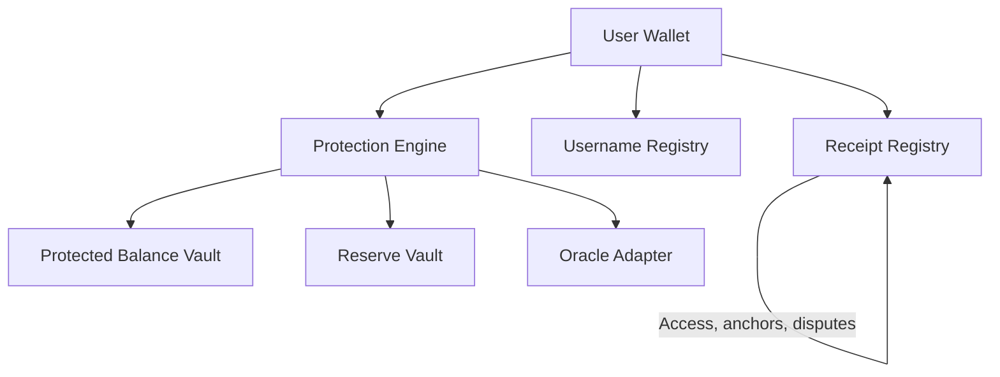
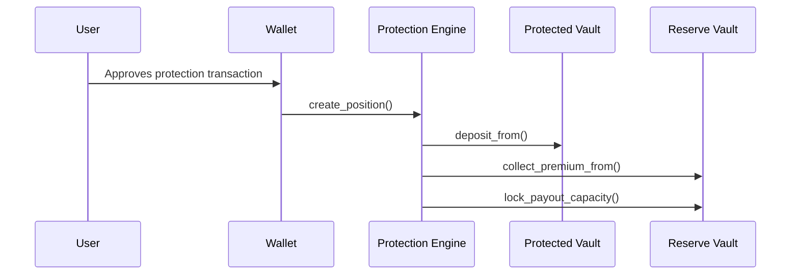
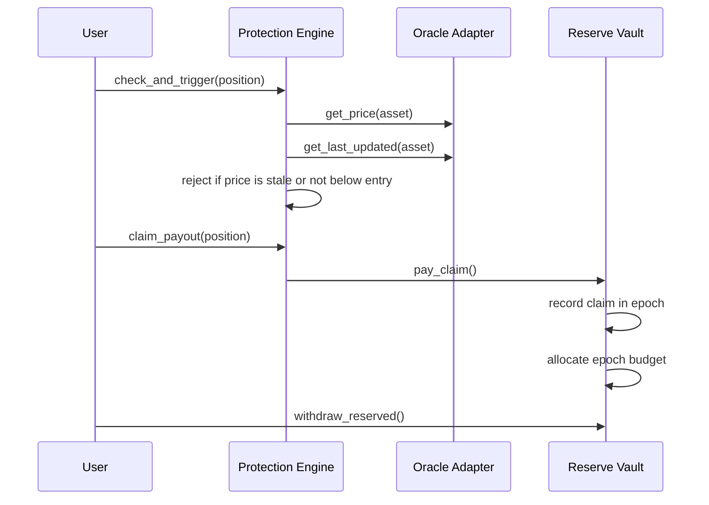
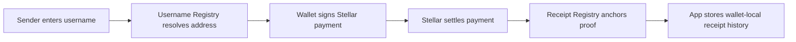
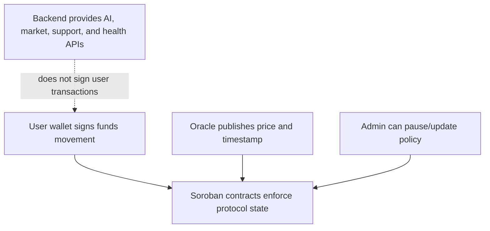

This page shows the main CoverFi flows as diagrams.

## Contract map

## Protection creation

## Claim path

## Username payment and receipt flow

## Trust boundaries

Important boundaries:

- Backend cannot sign user transactions.
- AI cannot move funds.
- Oracle must be fresh before trigger checks pass.
- Admin policy must be hardened before mainnet scale.
- Reserve allocation limits how much can be withdrawn in each epoch.
