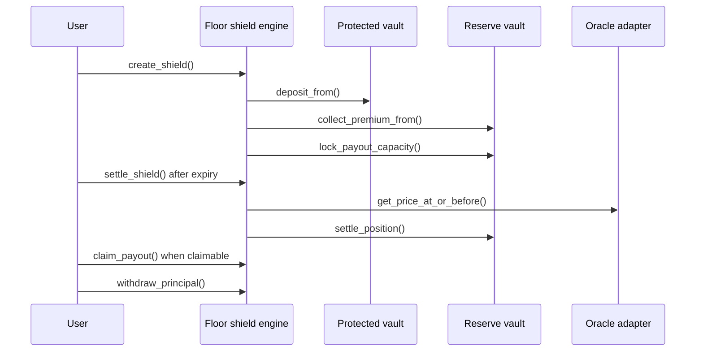

The `floor_shield_engine` lets a user define a floor price for a protected amount. If the expiry price is below that floor, the position becomes claimable up to a configured maximum payout cap.

## Responsibilities

- Quote a floor shield from a fresh oracle observation.
- Validate duration and floor price.
- Move protected principal into the protected vault.
- Collect premium through the reserve vault.
- Lock maximum payout capacity.
- Settle after expiry using an oracle observation at or before expiry.
- Let the owner claim payout and withdraw principal according to status.

## Main methods

```txt
initialize(admin, protected_vault, reserve_vault, oracle_adapter, protected_asset, payout_asset, premium_asset)
quote_shield(amount, floor_price, duration_seconds)
create_shield(user, amount, floor_price, duration_seconds, partner)
settle_shield(caller, shield_id)
claim_payout(user, shield_id)
withdraw_principal(user, shield_id)
get_shield(shield_id)
get_user_shields(user)
pause(admin)
unpause(admin)
```

## Flow



## Boundary

Floor shield is an experimental product contract. Treat it as separate from the core protection engine when scoping mainnet launch or audit work.
