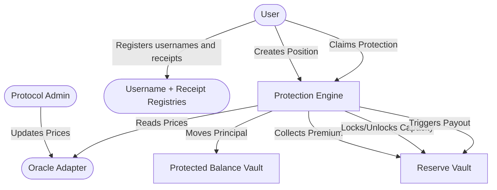

CoverFi's smart contracts provide the on-chain rules for protection positions, vault accounting, oracle checks, usernames, receipts, access, anchors, and disputes.

The canonical source in this workspace is `coverfi-contracts`.

## Money and state flow

For a user protecting `1000` units with a `1%` fee and a `10%` max payout cap:

1. The user creates a protection position.
2. Principal (`1000` units) moves into the `protected_balance_vault`.
3. Premium (`10` units) moves directly into the `reserve_vault`.
4. The `reserve_vault` locks the max payout capacity (`100` units).
5. The position is stored as active in the engine.

If the oracle price falls below the entry price before expiry, the payout is calculated based on the price loss and is capped by the configured maximum payout basis points.

The registry contracts support usernames, payment receipts, receipt access, receipt anchoring, and disputes. The receipt functions now live in one `receipt_registry` contract so the MVP has fewer deployments and simpler reviewer verification.

See [Architecture Diagrams](/smart-contracts/architecture) for visual flows.
