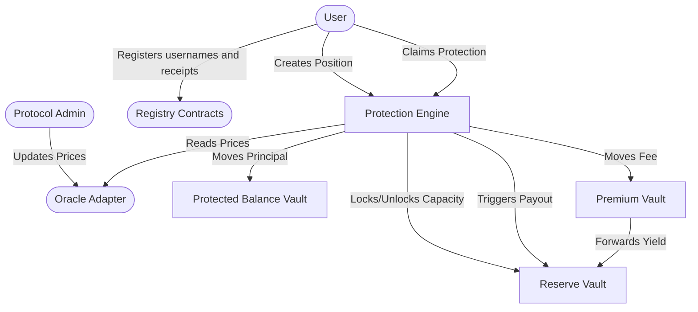

The CoverFi smart contract ecosystem provides a decentralized stablecoin loss protection mechanism built on Stellar and Soroban. These contracts have been open-sourced at [CoverFI-space/coverfi-contracts](https://github.com/CoverFI-space/coverfi-contracts.git).

## Architecture Diagram

The following diagram illustrates the interactions between the main components of the CoverFi contract ecosystem:

## Money and Data Flow

For a user protecting `1000` units with a `1%` fee and a `10%` max payout cap:

1. **Initiation**: The user creates a protection position.
2. **Principal**: The principal amount (`1000` units) moves into the `protected_balance_vault`.
3. **Fee Collection**: The protection fee (`10` units) moves into the `premium_vault`.
4. **Yield Routing**: The `premium_vault` forwards fees to the `reserve_vault`.
5. **Capacity Locking**: The `reserve_vault` locks the maximum payout capacity (`100` units).
6. **Data Storage**: The position is stored as active in the engine's state.

If the oracle price falls below the trigger before expiry, the payout is calculated based on the price loss and is capped by the configured maximum payout basis points.

The registry contracts support usernames, payment receipts, receipt access, receipt anchoring, and disputes. They are documented separately because they support app workflows without changing the reserve math.
