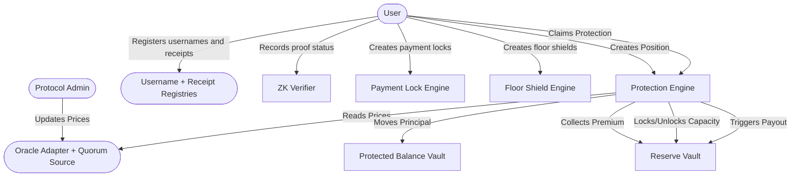

CoverFi's smart contracts provide the on-chain rules for protection positions, reserve accounting, oracle checks, usernames, executed payment receipts, access, anchors, disputes, payment locks, floor shields, and proof-status records.

The canonical source in this workspace is `coverfi-contracts`.

## Money and state flow

For a user protecting `1000` units with a `1%` fee and a `10%` max payout cap:

1. The user creates a protection position.
2. Principal (`1000` units) moves into the `protected_balance_vault`.
3. Premium (`10` units) moves directly into the `reserve_vault`.
4. The `reserve_vault` locks the max payout capacity (`100` units).
5. The position is stored as active in the engine.

If the oracle price falls below the entry price before expiry, the payout is calculated based on the price loss and is capped by the configured maximum payout basis points.

The registry contracts support usernames, payment receipts, receipt access, receipt anchoring, and disputes. The receipt functions live in one `receipt_registry` contract so the MVP has fewer deployments and simpler reviewer verification.

## Current workspace contracts

| Contract | Role |
| --- | --- |
| `protection_engine` | Core protection quote, creation, settlement, payout claim, and principal withdrawal flow. |
| `reserve_vault` | Provider shares, premium routing, locked payout capacity, reserved claims, and withdrawal queue. |
| `protected_balance_vault` | Engine-only custody of protected principal. |
| `oracle_adapter` | Observation storage, freshness checks, fallback submissions, and expiry-price reads. |
| `quorum_oracle_source` | Three-publisher quorum source compatible with the adapter's source interface. |
| `username_registry` | Username registration, lookup, renewal, release, and availability. |
| `receipt_registry` | Receipt hashes, access grants, batch anchors, disputes, and terms acceptance. |
| `zk_verifier` | Circuit metadata and proof-status records. |
| `payment_lock_engine` | Direct payment plus recipient value-protection flow. |
| `floor_shield_engine` | Floor-price protection flow with reserve-backed payout and principal exit. |

See [Architecture Diagrams](/smart-contracts/architecture) for visual flows.
