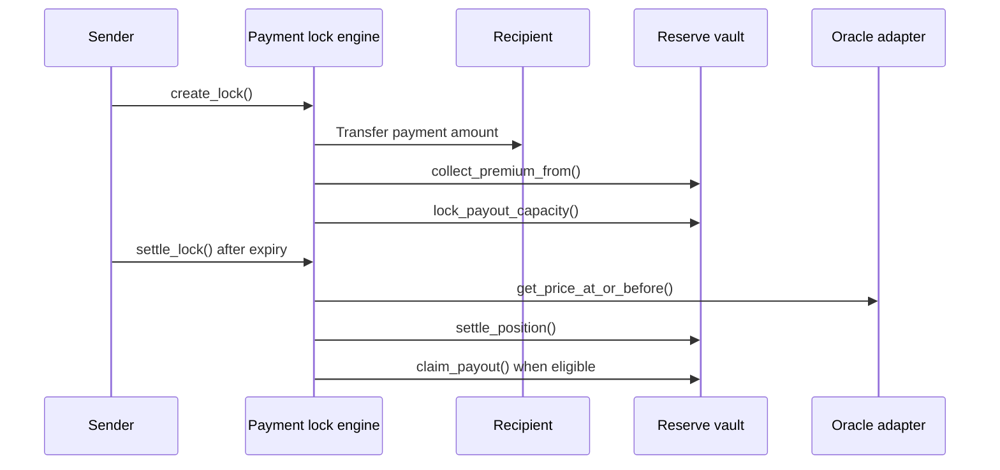

The `payment_lock_engine` supports short-duration payment protection. The sender pays the recipient immediately and pays a premium. If the protected asset loses value by expiry, the recipient can receive a reserve-backed payout according to contract rules.

## Responsibilities

- Quote payment lock cost from a fresh oracle price.
- Execute the payment transfer from sender to recipient during lock creation.
- Collect premium and automation fee through the reserve vault.
- Lock maximum payout capacity for the recipient.
- Settle after expiry using an oracle observation at or before expiry.
- Pay the recipient automatically through the reserve vault when payout is due.
- Prevent duplicate reference hashes.

## Main methods

```txt
initialize(admin, reserve_vault, oracle_adapter, payment_asset, payout_asset, premium_asset, max_oracle_age_seconds)
quote_lock(payment_amount, duration_seconds)
create_lock(sender, recipient, payment_amount, duration_seconds, reference_hash, partner)
settle_lock(caller, lock_id)
get_lock(lock_id)
get_user_locks(user)
pause(admin)
unpause(admin)
```

## Flow



## Boundary

Payment lock is separate from username payments. Username payments are plain wallet-signed Stellar payments with optional receipt anchoring. Payment lock adds a contract-defined value-protection path around a payment.
