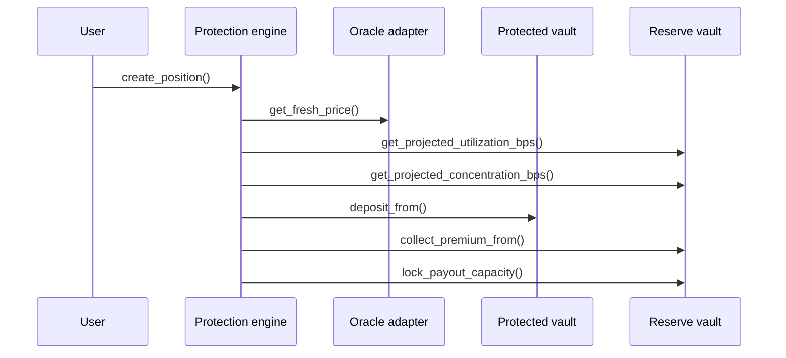

The `protection_engine` is the central coordinator of the CoverFi ecosystem. It interfaces with users and manages the lifecycle of V2 protection positions.

## Core Responsibilities

- **Position Lifecycle**: Opens positions, settles them at expiry, lets owners claim payouts, and lets owners withdraw protected principal.
- **Math & Calculations**: Computes quote components, notional, risk premium, total due, and maximum payout capacity.
- **Cross-Contract Coordination**: Moves protected principal through the `protected_balance_vault` and reserves payout capacity in the `reserve_vault`.
- **Oracle Verification**: Reads a fresh entry observation at purchase and an observation at or before expiry during settlement.
- **Payout Coordination**: Reserves the complete calculated payout for the settled position; no normal epoch allocation step is required.
- **Compliance Gate**: For high-value claims or withdrawals, checks proof-status records in `zk_verifier` when the configured threshold requires MFA and KYC attestations.

## Position states

| State | Meaning |
| --- | --- |
| `Active` | Position is open and has not reached successful settlement. |
| `AwaitingOracle` | Expiry was reached, but a valid expiry observation was not available. |
| `SettledNoPayout` | Position settled with no eligible payout. |
| `Claimable` | Position settled with a reserved payout claim. |
| `Claimed` | Reserved payout was claimed, but principal may still need withdrawal. |
| `PrincipalWithdrawn` | Protected principal has been withdrawn after settlement rules allowed exit. |

## Quote inputs

The V2 quote exposes more than one premium number so reviewers can see why a user is paying the displayed fee.

| Input | Source |
| --- | --- |
| Entry price | Fresh oracle observation from `oracle_adapter`. |
| Base premium | Duration schedule: 1, 7, 14, or 30 day term bands. |
| Volatility surcharge | `oracle_adapter.get_volatility_bps`. |
| Utilization surcharge | `reserve_vault.get_projected_utilization_bps`. |
| Concentration surcharge | `reserve_vault.get_projected_concentration_bps`. |
| Safety margin | Contract-defined basis-point margin. |
| Automation fee | Fixed fee converted into premium asset terms. |

## Key Functions

### `create_position()`
Opens a new protection position, reads a fresh oracle price as the entry price, calculates fees, moves protected principal into the protected balance vault, and collects premium into the reserve vault.

### `quote_position()`
Returns the V2 quote components: entry price, notional, maximum payout, base premium, volatility/utilization/concentration surcharges, safety margin, risk premium, protocol commission, automation fee, total due, and utilization/concentration/volatility basis points.

### `settle_position()`
Can be called after expiry by any caller. It reads the latest valid oracle observation at or before expiry, computes the settlement result, releases unused capacity, and reserves any calculated payout for the position owner.

### `claim_payout()`
Lets the position owner claim the reserved payout after settlement when the position is claimable.

### `withdraw_principal()`
Lets the position owner withdraw protected principal after settlement or no-payout settlement, according to contract state.

### `pause()` / `unpause()`
Admin controls for new sales. Settlement, payout claims, and principal withdrawal should remain available for exits.

## Cross-contract sequence

## Safety notes

- New position creation is blocked while paused.
- Settlement remains available while paused so users can exit old positions.
- The engine rejects unsupported markets, invalid durations, stale entry prices, unsafe utilization, excessive concentration, and too-small notionals.
- Payout claims are owner-only and can be claimed once through the reserve vault.
