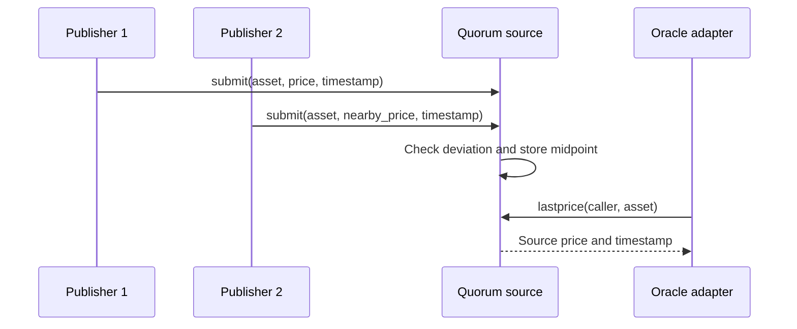

The `quorum_oracle_source` contract is a source contract compatible with the `oracle_adapter` source interface. It accepts submissions from three configured publishers and stores a source price when at least two publishers agree within the configured deviation threshold.

## Responsibilities

- Store the configured admin and three publisher addresses.
- Reject duplicate publisher addresses during initialization.
- Require publisher authorization for submissions.
- Reject non-positive prices and future timestamps.
- Reject duplicate submissions from the same publisher for the same asset and timestamp.
- Store the midpoint of the closest agreeing publisher pair when quorum is reached.
- Expose `lastprice` and `price` methods expected by the oracle adapter source interface.

## Main methods

```txt
initialize(admin, publisher1, publisher2, publisher3, max_age_seconds, max_deviation_bps)
submit(publisher, asset, price, timestamp)
lastprice(caller, asset)
price(caller, asset, timestamp)
get_config()
propose_admin(admin, pending)
accept_admin(pending)
```

## Flow



## Production note

This source improves over a single publisher, but mainnet policy should still document source selection, publisher custody, alerting, emergency pause, and replacement procedures.
