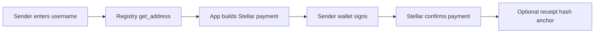

CoverFi includes registry contracts alongside the protection engine and vault system.

## `username_registry`

Maps a human-readable CoverFi username to a Stellar wallet address. This supports executed username payments and user discovery.

Key readiness checks:

- Enforce username format and length.
- Prevent duplicate registrations.
- Require user authorization for registration or updates.
- Reject reserved names.
- Enforce lowercase username rules.
- Support renewal, release, reverse lookup, and availability checks.

Username payment sequence:

## `receipt_registry`

Stores optional paid payment receipt records created after wallet-signed payments and combines the previous receipt access, anchor, and dispute surfaces.

Current controls:

- Owner authorization for receipt creation.
- Canonical receipt hash and reference hash anchoring.
- No duplicate receipt creation for the same receipt hash.
- Individual receipt-print fees route to the configured treasury wallet for the current MVP.
- Only the receipt owner can grant access.
- Revocation is tested.
- Merchant-signed batch anchoring.
- Batch count and root validation.
- Immutable historical anchors.
- Prevent unauthorized dispute mutation.
- Store clear status transitions.
- Keep personally sensitive data off-chain.

Remaining limitation:

- The registry stores a receipt proof hash, but it cannot independently prove that the referenced Stellar payment settled. The app/backend must verify settlement before offering paid receipt printing.
