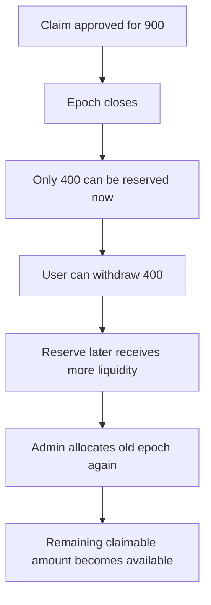

The `reserve_vault` is the liquidity backbone of CoverFi. It holds funds provided by liquidity providers and accumulated premiums, and accounts for capacity that can support eligible claims.

## Core Responsibilities

- **Capacity Locking**: When a position is opened, the reserve vault locks the maximum possible payout capacity for that specific position. This is a solvency control, not a guarantee of payout.
- **Capacity Release**: If a position expires without a trigger, the locked capacity is released back into the available liquidity pool.
- **Restricted Claim Accounting**: If a position is successfully claimed, the vault records the approved claim into the current epoch instead of paying immediately.
- **Reserved Withdrawals**: After an epoch is closed, the user withdraws only the amount reserved for their claim.

## Payout Policy

The reserve vault follows an epoched, reserved-claimable model:

```txt
free_liquidity = total_reserve - locked_reserve - reserved_reserve
floor_reserve = total_reserve * floor_bps / 10000
surplus = max(0, free_liquidity - floor_reserve)
epoch_budget = min(unpaid_epoch_total, surplus * drain_bps / 10000)
```

Current testnet defaults:

| Setting | Value |
| --- | --- |
| `floor_bps` | `2000` |
| `drain_bps` | `5000` |

## Key Functions

### `lock_capacity()`
Reserves liquidity for a potential payout, reducing the vault's "available" balance while maintaining its "total" balance.

### `release_capacity()`
Unlocks liquidity when a position expires naturally.

### `pay_claim()`
Records an approved claim into the current epoch and releases the position's locked capacity. It does not transfer funds immediately.

### `close_epoch()`
Allocates reserve budget to approved claims using the configured floor and drain policy.

### `allocate_epoch()`
Allocates additional reserve budget to an older epoch. This is useful when an epoch was only partially funded, then the reserve later receives more liquidity.

### `withdraw_reserved()`
Transfers the user's reserved amount and deducts it from total reserve and reserved reserve.

### `get_floor_bps()` and `get_drain_bps()`
Expose the current restricted payout policy for monitors and operators.

## User-friendly example



The reserve vault is intentionally conservative. It can approve a claim but only release what the restricted payout policy allocates.
