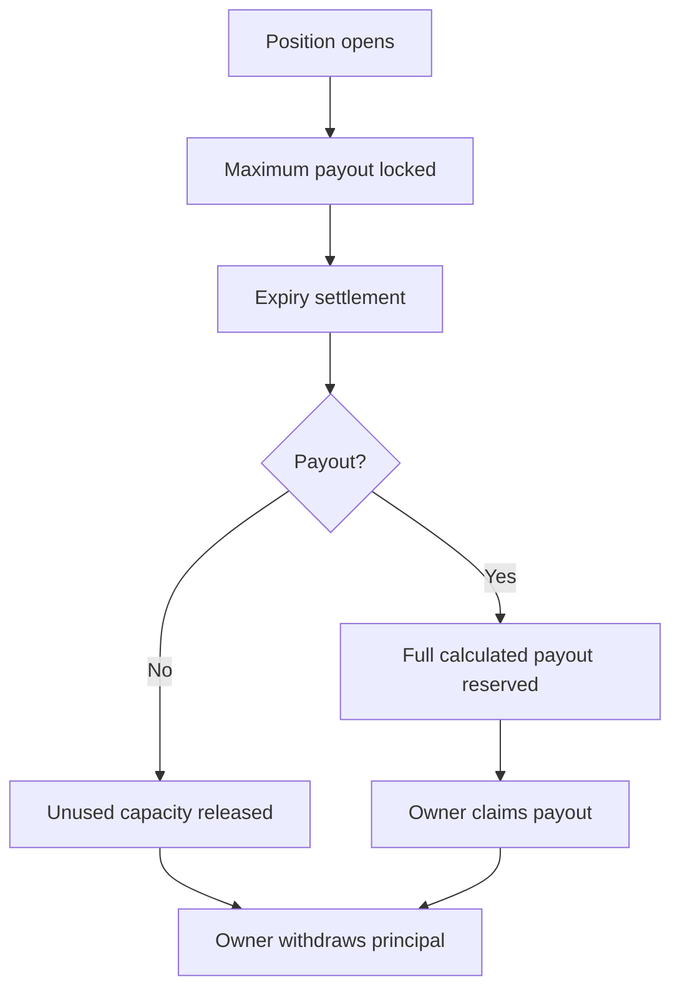

The `reserve_vault` is the liquidity backbone of CoverFi. It holds provider assets and restricted protocol balances, mints internal provider shares, locks position-specific maximum payout capacity, and reserves settled payouts.

## Core Responsibilities

- **Capacity Locking**: When a position is opened, the reserve vault locks the maximum possible payout capacity for that specific position. This is a solvency control, not a guarantee of payout.
- **Expiry Settlement Accounting**: Settlement releases unused capacity or reserves the full calculated payout for that position.
- **Provider Shares And NAV**: Reserve providers receive shares and participate in matured underwriting results and realized claim losses.
- **Withdrawal Queue**: Providers request withdrawals, wait through the cooldown, and can execute only when active backing remains safe.
- **Restricted Balances**: Locked liabilities, reserved claims, unearned premiums, safety funds, and automation funds are excluded from provider withdrawals.

## V2 Accounting

The V2 vault tracks pool state directly:

```txt
provider_nav = total_assets
  - locked_liabilities
  - reserved_claims
  - unearned_premiums
  - safety_balance
  - automation_balance

available_liquidity = provider_nav
```

V2 premium routing is bounded and visible. The protocol-fee rate defaults to `1200` bps and can be configured by admin within a `1000` to `1500` bps range:

| Setting | Value |
| --- | --- |
| Underwriting | `7800` bps |
| Protocol | `1000-1500` bps, default `1200` bps |
| Safety | `700` bps |
| Automation | Remainder plus fixed automation fee |

The protocol portion is transferred to the configured treasury address automatically when `collect_premium_from()` runs. If the position includes an approved partner address, the partner reward is paid from the protocol portion first and the remainder goes to treasury.

## Key Functions

### `deposit_reserve()`
Accepts reserve-provider capital and mints shares using current provider NAV.

### `lock_payout_capacity()`
Reserves liquidity for a potential position payout, reducing available liquidity while preserving total assets.

### `settle_position()`
Called by the engine during expiry settlement. It releases unused capacity or moves the calculated payout into `reserved_claims`.

### `claim_payout()`
Transfers the reserved payout to the owner and marks the claim as withdrawn.

### `set_treasury()` / `set_protocol_fee_bps()`
Admin-only controls for the treasury recipient and protocol-fee rate. The rate is bounded to the published `1000-1500` bps range.

### `request_withdraw()` / `cancel_withdraw()` / `execute_withdraw()`
Manage reserve-provider withdrawal requests with a cooldown and safety checks.

### `get_pool()`
Exposes pool assets, shares, locked liabilities, reserved claims, unearned premiums, safety balance, automation balance, cumulative protocol revenue, cumulative underwriting, and cumulative claims.

## User-friendly example



The reserve vault is intentionally conservative. It never lets provider withdrawals use locked liabilities, reserved claims, or other restricted balances.
