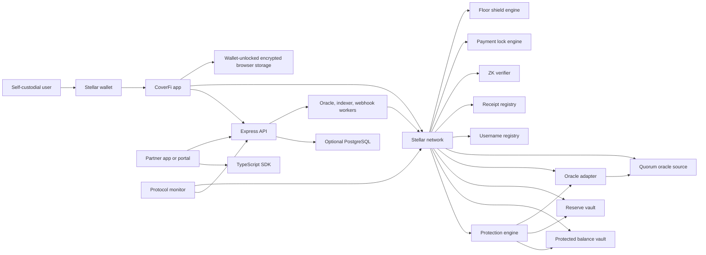
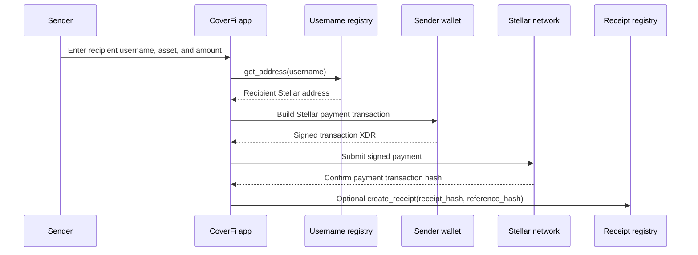
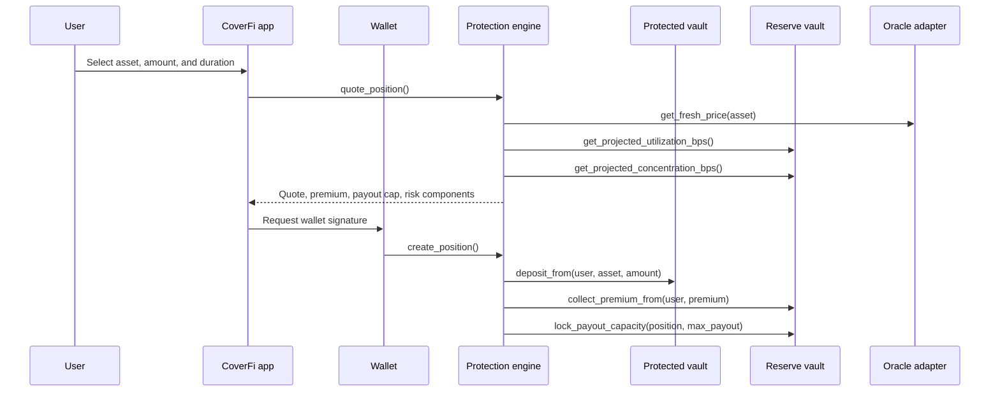
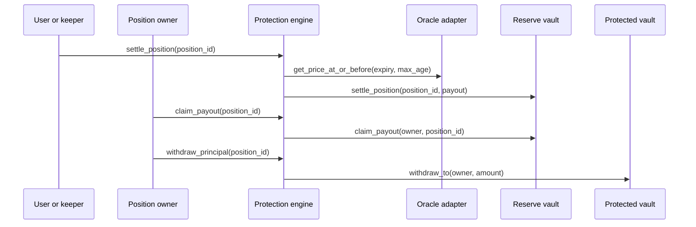

This page explains the current CoverFi architecture for Stellar Community Fund reviewers, Stellar technical reviewers, partners, and operators.

CoverFi is a Stellar-native app with two user-facing money flows:

- Executed username payments: a sender resolves a Soroban username, signs a Stellar payment, submits it to the network, and can anchor a receipt hash after confirmation.
- Contract-defined protection: a user opens a Soroban protection position, pays a transparent premium, locks reserve payout capacity, and settles against oracle data at expiry.

CoverFi protection is not insurance. Payouts are not guaranteed. Outcomes depend on wallet signatures, contract rules, oracle freshness, reserve state, and Stellar network execution.

## Current system map



## Architecture layers

| Layer | Current implementation | Source of truth |
| --- | --- | --- |
| Wallet and signing | Users sign login challenges, Stellar payments, receipt anchors, protection creation, claims, and withdrawals from their own wallet. | User wallet and Stellar transaction result |
| App | `logic-pages` prepares transactions, explains risk, resolves usernames, stores private local history, and displays protocol state. | Browser plus Stellar/Soroban reads |
| Backend API | `server` handles wallet sessions, market data, AI support, status routes, partner APIs, invoices, webhooks, KYC/KYB hooks, and operational tooling. | Non-authoritative support layer |
| Contracts | `coverfi-contracts` enforces protection, reserves, usernames, receipts, oracle observations, proof-status records, payment locks, and floor shields. | Soroban contract state |
| Monitor | `coverfi-monitor` reads backend status and Soroban state for reserve, oracle, and deployment checks. | Backend status plus Soroban getters |
| Partner platform | `partner-portal`, `packages/coverfi-sdk`, and backend partner routes expose sandbox APIs and signed webhook events. | Partner database plus contract/customer wallet execution |
| Documentation | `docs` explains app, backend, economics, contracts, security, deployment, and reviewer flow. | Versioned project docs |

## Executed username payment flow

Username payments are a completed app flow, not only an AI draft.



The app implementation resolves usernames with `get_address`, builds a Stellar `Operation.payment`, asks the wallet to sign, submits the signed transaction, polls for confirmation, and then optionally anchors a receipt hash with `create_receipt`.

Private payment notes and user receipt history stay in wallet-unlocked encrypted browser storage. The receipt registry stores hashes and access state, not raw private notes.

## Protection position flow



The protection engine coordinates the money path. The backend does not sign or custody user funds.

## Settlement and exit flow



Settlement is permissionless after expiry. Payout claims and principal withdrawals are owner-only. If the oracle observation is missing or too old, the position waits in an oracle-needed state instead of settling unsafely.

## Contract workspace

The current Soroban workspace has ten contracts.

| Contract | Role |
| --- | --- |
| `protection_engine` | Quotes, opens, settles, and exits protection positions. |
| `reserve_vault` | Holds reserve assets, routes premiums, locks maximum payout capacity, reserves claims, pays keepers, and manages provider withdrawals. |
| `protected_balance_vault` | Holds protected principal and only accepts movement instructions from the configured engine. |
| `oracle_adapter` | Stores observations, validates freshness, accepts source refreshes or fallback publisher submissions, and exposes historical reads at or before expiry. |
| `quorum_oracle_source` | Accepts three publisher submissions and stores a fresh price when at least two publishers agree within deviation bounds. |
| `username_registry` | Registers usernames, resolves usernames to addresses, exposes reverse lookup, renewal, release, and availability checks. |
| `receipt_registry` | Anchors receipt hashes, prevents duplicate receipt hashes, manages access grants, batch anchors, disputes, and terms acceptance. |
| `zk_verifier` | Registers verifier metadata and records proof-status attestations for subjects and circuits. |
| `payment_lock_engine` | Executes direct payments with a short-term value-protection payout path for the recipient. |
| `floor_shield_engine` | Creates floor-based protection positions with principal custody, reserve capacity lock, settlement, payout claim, and principal withdrawal. |

## Reserve accounting model

Reserve accounting separates user claims from provider withdrawable NAV.

```txt
provider_nav = total_assets
  - locked_liabilities
  - reserved_claims
  - unearned_premiums
  - safety_balance
  - automation_balance
```

Important reserve controls:

- New positions lock maximum payout capacity before exposure is accepted.
- Settled payouts are reserved for a specific position.
- Provider withdrawals use shares, NAV, cooldown, and available-liquidity checks.
- Locked liabilities, reserved claims, unearned premiums, safety funds, and automation funds are excluded from provider withdrawals.
- Premium routing is visible in contract state and tests.

## Oracle model

The current architecture separates oracle source and adapter behavior.

| Component | Responsibility |
| --- | --- |
| `quorum_oracle_source` | Accepts signed publisher submissions and stores source prices when quorum is reached. |
| `oracle_adapter` | Reads a source price, normalizes decimals, stores observations per protected asset, rejects excessive deviation, and exposes fresh/latest/historical observation getters. |
| Backend oracle tooling | Publishes configured Testnet observations and validates mainnet publisher configuration. |

Mainnet scale requires a documented multi-source or established Stellar-compatible oracle policy. Testnet can use controlled publishers for reviewer and smoke-test flows.

## Backend and data boundaries

The backend supports the product but is not the financial source of truth.

| Backend area | Purpose | Boundary |
| --- | --- | --- |
| Wallet auth | Signed wallet challenge/session tokens for private routes. | Does not custody keys. |
| Market data | Informational prices and app context. | Contracts settle from oracle observations, not UI market text. |
| Partner API | Quotes, positions, sessions, assets, pricing, usage, claims, payouts, receipts, webhooks, and invoices. | User wallet still signs fund-moving transactions. |
| Webhooks | Signed partner event delivery with retry state. | Partner URLs and signing secrets must be production-hardened. |
| KYC/KYB and proof events | Optional Didit-backed status and ZK proof-status records. | Provider documents are not stored as public proof data. |
| Local-only compatibility routes | Older app routes return explicit local-storage boundaries. | Private user records remain browser-local unless explicitly part of partner/operational features. |

## Current verification commands

Run these from the repository root or package folders.

```powershell
npm --prefix server run check
npm --prefix server test
npm --prefix packages/coverfi-sdk run check
npm --prefix partner-sdk run check
npm --prefix logic-pages run build
npm --prefix partner-portal run build
npm --prefix coverfi-monitor run build
npm --prefix coverfi-research run build
npm --prefix mian-page run build
cd coverfi-contracts
cargo test
```

Latest local verification before this page was added:

| Check | Result |
| --- | --- |
| Backend syntax | Passed |
| Backend tests | `26/26` passed |
| Official SDK TypeScript check | Passed |
| Legacy partner SDK TypeScript check | Passed |
| Main app build | Passed |
| Partner portal build | Passed |
| Monitor build | Passed |
| Research app build | Passed |
| Landing app build | Passed |
| Soroban workspace tests | `46` unit tests passed plus doctests |

## Mainnet readiness boundaries

CoverFi should not be presented as ready for meaningful mainnet value until these are complete:

- Third-party smart contract audit or audit-bank review.
- Production oracle quorum or established oracle-provider policy.
- Multisig or admin-controller setup for privileged actions.
- Production secret rotation and shared session revocation storage.
- Distributed rate limiting for horizontally scaled backend services.
- Partner webhook URL validation, idempotency, and per-key rate-limit enforcement.
- Legal review of terms, privacy, and non-insurance language.
- Production monitoring, incident response, and deployment smoke-test runbooks.
